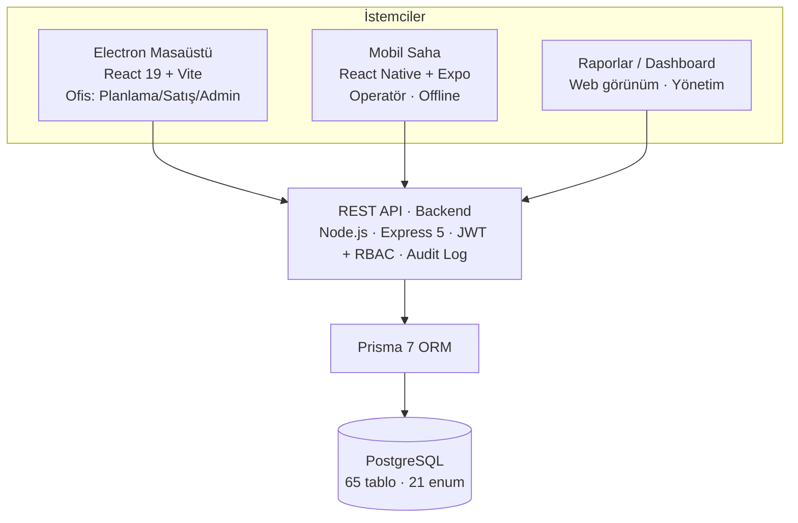
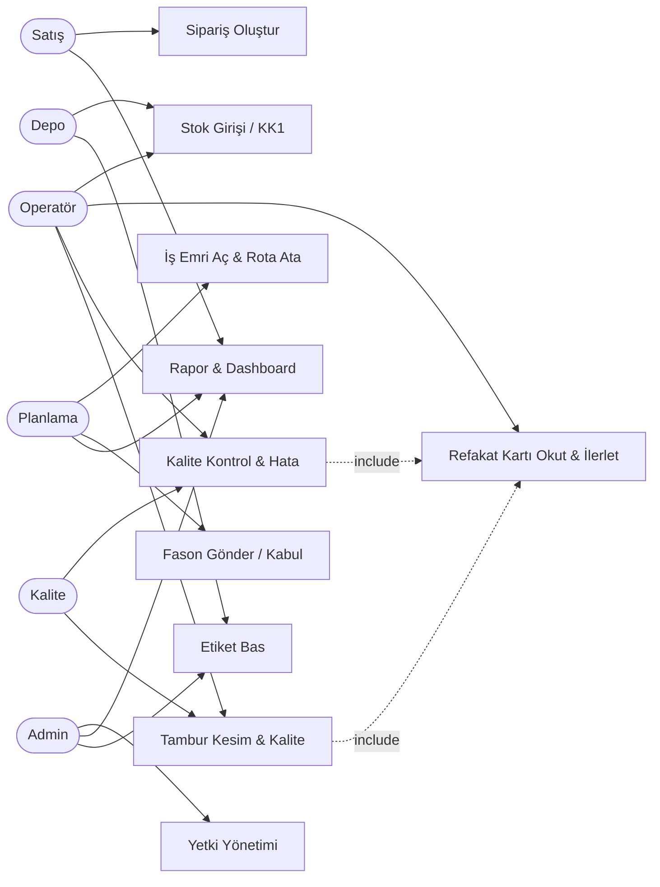
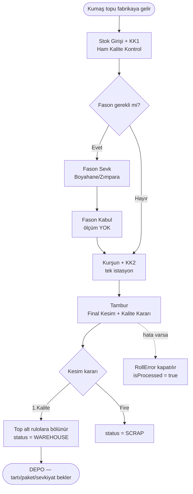
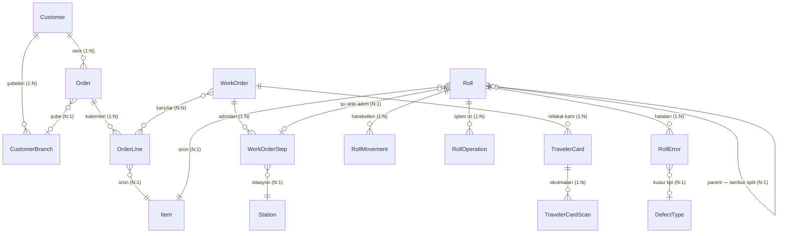
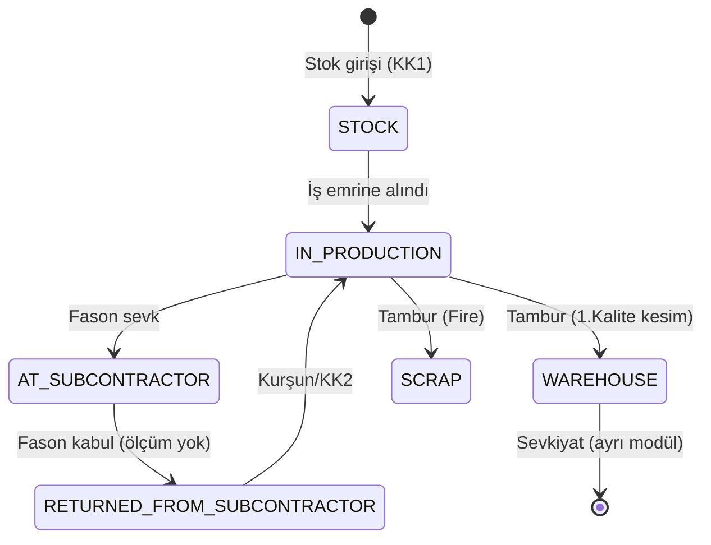

# TeksERP — Tekstil Fabrikası Üretim Takip Sistemi
## Agile / Scrum Yaklaşımıyla Sistem Analizi ve Tasarımı — Detaylı Rapor

> **Hazırlayan:** Oğuzhan Ahmet Demirci — Yönetim Bilişim Sistemleri (Yüksek Lisans)
> **Okul No:** 702534013
> **Ders:** Sistem Analizi ve Tasarımı
> **Proje:** TeksERP — Tekstil Fabrikası ERP (gerçek, geliştirilmekte olan sistem)
> **Yaklaşım:** Agile / Scrum

---

## Özet

Bu rapor, gerçek ve hâlen geliştirilmekte olan bir kurumsal yazılımın — **TeksERP**'nin — Agile/Scrum yaklaşımıyla nasıl analiz edilip planlandığını anlatır. TeksERP, bir tekstil fabrikasının üretim, kalite kontrol ve sevkiyat süreçlerini **top (rulo) bazlı tam izlenebilirlikle** dijitalleştiren, üç katmanlı (backend + masaüstü + mobil saha) bir sistemdir.

Projede Agile tercih edildi çünkü domain (tekstil üretim kuralları) baştan net değildi; kurallar ancak fabrikayla konuşa konuşa, sprint sprint keşfedildi. Örneğin sevkiyat modülü üç kez yeniden tasarlandı; "Kurşun + KK2 tek istasyon mu?" veya "Fason dönüşte ölçüm yapılır mı?" gibi kritik kurallar Sprint Review'larda netleşti. Rapor, bu deneyimleri Agile/Scrum kavramlarıyla ilişkilendirerek aktarır.

**Sistemin güncel ölçeği (sayılarla):**

| Metrik | Değer |
|---|---|
| Veri modeli (PostgreSQL tablosu) | **65** |
| Enum (sabit değer kümesi) | **21** |
| Yetki kodu (RBAC permission) | **54** |
| Yetki modülü | **10** |
| Backend API route grubu | **38** |
| Fonksiyonel modül (kullanıcıya görünen) | **~16** |
| Üretim istasyonu | **4** (KK1 → Fason → Kurşun+KK2 → Tambur) |
| Platform | **3** (tek backend; masaüstü + mobil + web rapor) |
| İzlenebilirlik | **%100** — her top barkodlu, her işlem audit kaydında |

---

## İçindekiler

1. Proje Tanımı
2. Agile Yaklaşımının Açıklanması
3. Scrum Yapısının Oluşturulması
4. Product Backlog
5. Sprint Planlaması
6. Scrum Süreçlerinin (Etkinliklerinin) Açıklanması
7. Sistem Tasarımı (Mimari + Use Case + Activity + ER + Durum Diyagramı)
8. Sonuç ve Değerlendirme
- Ek A: Terimler Sözlüğü
- Ek B: Gerçek Sistem Ölçek Metrikleri

---

## 1. Proje Tanımı

### 1.1 Projenin Amacı

TeksERP, bir **tekstil fabrikasının üretim, kalite kontrol ve sevkiyat süreçlerini uçtan uca dijitalleştiren** bir kurumsal kaynak planlama (ERP) sistemidir. Sistemin merkezinde **top (rulo / "Roll") bazlı izlenebilirlik** vardır: fabrikaya giren her kumaş topu, barkodlu bir kimlikle kayıt altına alınır ve depodan çıkana kadar geçtiği her istasyon, gördüğü her işlem ve oluşan her kalite hatası iz olarak tutulur.

Önemli bir domain ayırt edici özelliği: fabrika **çözgü/dokuma yapmaz** — kumaş hazır olarak gelir. Fabrika yalnızca **proses (kurşun, boya/zımpara fasonu vb.) + kalite kontrol + tambur (final karar)** işlemlerini yapar. Bu nedenle sistemde "üretim" denildiğinde, dokuma değil, bu işlem zincirinin yönetimi kastedilir.

Tek cümleyle: **"Hangi top nerede, hangi kalitede, hangi siparişi karşılıyor?" sorularına her an kesin yanıt verebilen bir izlenebilirlik omurgası kurmak.**

### 1.2 Hangi Probleme Çözüm Üretiyor?

Geleneksel tekstil fabrikalarında süreçler büyük ölçüde **kağıt-kalem ve operatörün hafızası** ile yürür. Bu yöntemin yarattığı somut problemler ve TeksERP'nin çözümleri:

| Problem (ÖNCE) | TeksERP Çözümü (SONRA) |
|---|---|
| **Topun fiziksel konumu bilinmiyor** — "Hangi top nerede?" sorusuna yanıt yok | Her topun anlık `RollStatus`'u (Stok / Üretimde / Fasonda / Depo …) ve bulunduğu istasyon sistemde tutulur |
| **Kalite hataları kayıt altında değil** — hata kimde, hangi metrede, nasıl çözüldü belirsiz | `RollError` kaydı PROCESS_QC'de (KK2) açılır; metraj konumu + kusur tipi tutulur, Tambur'da kesim kararıyla kapanır (`isProcessed = true`) |
| **Fason takibi zayıf** — boyahaneye giden top karışıyor, dönüşte eşleşmiyor | `SubcontractorDispatch / Receipt` ile gönderim ve kabul barkodla eşleştirilir; orijinal rulo yerinde statü değiştirir (yeni kayıt yaratılmaz) |
| **Stok ↔ Sipariş eşleşmesi belirsiz** — hangi üretim hangi siparişi karşılıyor? | İş Emri ↔ Sipariş Kalemi **N:N** bağı, spec-toplam bazlı "karşılanma" hesabı (geç bağlama modeli) |
| **İzlenebilirlik / denetim yok** — kim ne zaman ne değiştirdi? | Her CUD (Create/Update/Delete) işlemi `SystemLog`'a (audit) yazılır; fiziksel silme yoktur (yalnız soft-delete) |
| **Operatör sahada bilgisayara bağlı** — kağıt fişle çalışıyor | **Refakat Kartı** (barkodlu) malla birlikte gezer; mobil tablet/telefonla sahada okutulur ve istasyon işlemlerini tetikler |

**Özetle dönüşüm:** *Kağıt-kalem · operatörün hafızası · kayıp izlenebilirlik* → *Barkodlu top · anlık durum · her işlem audit kaydında.*

### 1.3 Hedef Kullanıcı Kitlesi

| Kullanıcı | Rolü / İhtiyacı | Kullandığı Platform |
|---|---|---|
| **Fabrika Yönetimi / Sahibi** | Genel görünürlük, raporlar, üretim durumu, denetim | Masaüstü + Web rapor |
| **Planlama Şefi** | Sipariş → İş Emri açma, rota seçimi, üretim planlama | Masaüstü |
| **Satış Personeli** | Müşteri & sipariş yönetimi, müşteri-özel ürün/renk adları | Masaüstü |
| **Üretim Operatörü (saha)** | Refakat kartı okutma, istasyon işlemleri, offline çalışma | Mobil (tablet/telefon) |
| **Kalite Kontrol Personeli** | KK1 (ham kalite), KK2, hata kaydı, Tambur kalite sınıfı | Mobil + Masaüstü |
| **Depo Personeli** | Stok girişi, depo durumu, etiketleme, sevk hazırlığı | Mobil + Masaüstü |
| **Sistem Yöneticisi (Admin)** | Kullanıcı + yetki (RBAC) yönetimi, sistem ayarları | Masaüstü |

### 1.4 Sistemin Temel İşlevleri

TeksERP'nin kullanıcıya görünen başlıca **fonksiyonel modülleri** (~16):

1. **Stok / Envanter Yönetimi** — kumaş topu (Roll) girişi, yaşam döngüsü, soft-delete
2. **Sipariş Yönetimi** — müşteri, şube, sipariş kalemleri, müşteri-özel ürün/renk eşlemeleri
3. **Üretim Planlama / İş Emri** — İş Emri (WorkOrder) açma, rota (Route) atama, esnek sipariş bağlama
4. **KK1 (Ham Kalite Kontrol)** — fabrikaya giren kumaşın giriş ve ilk kalite kontrolü
5. **Kurşun + KK2 (Proses Kalite)** — tek fiziksel istasyon olarak modellenir
6. **Tambur (Final Kesim & Kalite Kararı)** — topun kesilip kalite sınıfının atandığı son nokta
7. **Fason Yönetimi** — boyahane/zımpara firmalarına gönderim ve kabul akışı
8. **Kartela** — bitmiş toptan numune/kartela üretim takibi
9. **Sevkiyat / Çuvallama** — depodan çıkış, çuval içerik/kod, termin yönetimi
10. **İade (Müşteri İadesi)** — iade girişi, kalite değerlendirme, defter kaydı
11. **Ürün Dengesi (MRP)** — net ihtiyaç hesabı (talep − depo − üretimde)
12. **Refakat Kartı & Barkod İzleme** — malla gezen kart, istasyonda okutma → süreç tetikleme
13. **Etiketleme** — top/numune etiketi tasarımı ve basımı (LabelTemplate)
14. **Raporlama & Dashboard** — üretim, satış, kalite, envanter, fason, denetim raporları
15. **Tanımlar (Master Data)** — ürün, renk, müşteri, istasyon, rota, kusur tipi, kalite sınıfı vb.
16. **Yetkilendirme (RBAC)** — **54 izin, 10 modül**, kullanıcı bazlı + şablon bazlı yetki

### 1.5 Teknik Mimari (özet)

Sistem **üç alt projeden (mono-repo)** oluşur ve hepsi tek bir REST API backend'ine bağlanır:

| Bileşen | Teknoloji | Görev |
|---|---|---|
| **Backend** | Node.js + Express 5 + Prisma 7 + PostgreSQL | REST API, iş kuralları, veri modeli (65 tablo) |
| **Yönetim Paneli** | Electron 33 + React 19 + Vite | Masaüstü ofis uygulaması (planlama, satış, admin) |
| **Mobil (Saha)** | React Native + Expo 54 (Android tablet + telefon) | Operatörlerin istasyonda kullandığı offline-aware uygulama |

**Katman kuralı (pazarlık dışı):** İstek `Route → Controller → Service → Prisma → PostgreSQL` zincirini izler; hiçbir katman alt katmanı atlamaz. Her CUD işlemi audit log'a yazılır; veriler asla fiziksel silinmez (yalnız `isActive: false` veya statü değişimi). Validation hata mesajları Türkçedir.

> **Gerçek ölçek:** Sistem şu an **65 veri modeli, 21 enum, 54 yetki kodu (10 modül), 38 API route grubu** içerir. Bu ödev, bu gerçek sistemin Agile/Scrum ile nasıl planlandığını anlatır — kurgu bir senaryo değil, yaşanmış bir geliştirme sürecidir.

---

## 2. Agile Yaklaşımının Açıklanması

### 2.1 Agile Nedir?

**Agile (Çevik) yazılım geliştirme**, 2001 Agile Manifesto'da tanımlanan, yazılımı **küçük parçalar halinde, iteratif ve artımlı (iterative & incremental)** olarak üreten bir yaklaşımlar ailesidir. Temel dört değeri:

> - **Bireyler ve etkileşimler** > süreçler ve araçlar
> - **Çalışan yazılım** > kapsamlı dokümantasyon
> - **Müşteri ile iş birliği** > sözleşme pazarlığı
> - **Değişime uyum** > planı takip etme

Burada "<" işareti soldakini değersiz kılmaz; sağdaki de değerlidir ama **soldaki daha değerlidir**. Yani Agile, baştan kusursuz bir plan yapıp ona sıkıca bağlı kalmak yerine; **kısa döngülerde çalışan ürün çıkarıp, geri bildirimle yönü düzelterek** ilerler.

**Biz nasıl uyguladık?** TeksERP'de bunu somutça şöyle yaşadık: her 2 haftalık sprint sonunda fabrikaya çalışan bir parça (örn. "KK1 ham giriş akışı") gösterdik; gelen geri bildirimle bir sonraki sprint'in işlerini **ve domain kurallarını** yeniden şekillendirdik. Yani "çalışan yazılım" ve "değişime uyum" değerleri bizim için soyut sloganlar değil, haftalık pratiğin kendisi oldu.

### 2.2 Geleneksel Yöntemlerden (Waterfall) Farkı

| Kriter | Geleneksel (Waterfall) | Agile |
|---|---|---|
| **Süreç** | Doğrusal: Analiz → Tasarım → Kod → Test → Teslim (geri dönüş zor) | İteratif: her sprint'te baştan sona mini-döngü |
| **Gereksinim** | Baştan tamamı sabitlenir, "dondurulur" | Sürekli evrilir; backlog yaşayan bir liste |
| **İlk çalışan ürün** | Projenin sonunda görülür | İlk sprint sonunda görülür |
| **Değişiklik** | Pahalı, dirençli ("kapsam dışı") | Beklenen, hoş karşılanan |
| **Risk** | Sonda patlar (geç keşif) | Erken ve sürekli azaltılır |
| **Müşteri katılımı** | Başta ve sonda | Her sprint'te (sürekli) |

### 2.3 Bizim Projede: Waterfall Olsaydı / Agile'da Böyle Oldu

Aşağıdaki tablo, projeden **gerçek** üç kararın iki yaklaşımda nasıl seyredeceğini karşılaştırır. Bu, Agile'ın soyut üstünlüğünü değil, **bu projede yaşanan somut farkı** gösterir.

| Karar / Konu | ✗ Waterfall olsaydı | ✓ Agile'da böyle oldu |
|---|---|---|
| **Kurşun + KK2 istasyonu** | Baştan "ayrı istasyon" varsayılıp tüm akış kodlanır; sonda fabrika "tek istasyon" der → akış yeniden yazılır. | Erken denendi, "tek fiziksel istasyon" (PROCESS_QC) öğrenildi; küçük bir düzeltmeyle çözüldü. |
| **Fason dönüş ölçümü** | "Dönüşte tartılır" varsayımı sona kadar taşınır; yanlış olduğu en sonda anlaşılır. | Review'da "tartmıyoruz, ölçüm sonraki istasyonda" geri bildirimi geldi → hemen düzeltildi. |
| **Sevkiyat modülü** | Tüm sevkiyat + paket + tahsis baştan dondurulur, aylarca kodlanır; sonda sahaya uymaz → komple çöp. | 3 sürümde evrildi (sıkı → gevşek → sade); çekirdek üretim akışı bu süre boyunca hiç durmadı. |

> **Özü:** Waterfall yanlış varsayımı **sonda** yakalar (pahalı); Agile **erken** yakalar (ucuz). Fark tam olarak budur.

### 2.4 Bu Proje Neden Agile? (Gerçek Gerekçeler)

**① Domain belirsizliği yüksek — fabrikayla konuşa konuşa öğreniliyor.**
Tekstil üretiminin kuralları yazılımcı için baştan net değildi. Örnekler:
- *"Kurşun ve KK2 ayrı istasyon mu, tek istasyon mu?"* → Tek fiziksel istasyon (`PROCESS_QC`); per-top log'da `KURSUN_APPLIED` / `QC2_COMPLETED` olarak iz tutulur.
- *"Fason dönüşte top yeniden tartılır mı?"* → Hayır; dönüşte ölçüm yapılmaz, ölçüm bir sonraki istasyonun `FINISH`'inde kaydedilir.
- *"Tambur'dan çıkan top doğrudan sevk mi edilir?"* → Hayır; kesinlikle önce depoya (`WAREHOUSE`) geçer.

Bu kuralların hiçbiri baştan bir şartnamede yazılı değildi; **iterasyonlarla keşfedildi.** Waterfall olsaydı, yanlış varsayımlarla aylarca kod yazılır, sonda her şey çökerdi.

**② Sevkiyat modülü 3 kez yeniden tasarlandı — değişime uyumun canlı kanıtı.**

| Sürüm | Neydi | Neden değişti |
|---|---|---|
| **1 · Sıkı bağlama + Tahsis** | Top baştan siparişe tahsis ediliyor; ayrı planlama tahtası + tahsis (allocation) kaydı | Karmaşık, sahaya uymadı → **tamamen silindi** |
| **2 · Gevşek (Loose) model** | Geç bağlama — top sevk anına kadar serbest; "Ürün Dengesi" + "Karşılanma" ekranları, değişebilir etiket | Görünürlük iyi ama hâlâ ağırdı |
| **3 · Sadeleştirilmiş** | Top↔sipariş bağı tamamen kalktı; Sevkiyat oturumu (Hazırlanıyor→Hazır→Sevk), çuval=no+kg, termin FIFO | Sadeleşti, sahada işler hale geldi |

> **Gevşek (Loose) bağlama = geç bağlama:** kumaş topları üretim boyunca hiçbir siparişe kilitlenmez, ortak havuzda "sahipsiz" durur; "bu top şu siparişe gidecek" kararı en sonda, sevk anında verilir. Sistem **gösterir ama zorlamaz.**

Agile sayesinde **eski kodu silip yeniden tasarlamak bir "felaket" değil, normal bir iterasyon** oldu. Çekirdek üretim modülü (KK1→Tambur) bu sırada hiç durmadan çalışmaya devam etti.

**③ Çok kanallı teslim — parçalı ilerleme şart.**
Backend + Electron masaüstü + mobil saha aynı anda gelişiyor. Her birini "tamamen bitirip" sonra entegre etmek yerine, **dikey dilimler** (örn. "KK1 istasyonu uçtan uca: backend + mobil ekran + masaüstü görünüm") halinde teslim ediliyor. Böylece her dilim, tek başına gösterilebilir ve test edilebilir bir değer üretiyor.

### 2.5 Agile'ın Bu Projeye Sağladığı Avantajlar

- **Erken çalışan ürün:** İlk sprint'ten sonra giriş + sipariş ekranı çalışıyor; fabrika erken deneyip yön verebiliyor.
- **Yanlış varsayımın erken yakalanması:** Domain kuralları Sprint Review'larda doğrulanıyor; aylar değil günler kaybediliyor.
- **Önceliklendirme:** Kritik üretim akışı (Yüksek öncelik) önce; nice-to-have özellikler (offline, gelişmiş raporlar) sonra.
- **Büyük değişimi sindirebilme:** Sevkiyat gibi bir modülün tamamen yeniden tasarlanması sürdürülebilir.
- **Şeffaflık:** Backlog + sprint board sayesinde herkes ne yapıldığını/yapılacağını görüyor.

---

## 3. Scrum Yapısının Oluşturulması

Scrum, Agile'ın en yaygın **çerçevesidir (framework)**. Üç rol, üç artefakt ve dört etkinlikten oluşur:

- **Roller:** Product Owner, Scrum Master, Development Team
- **Artefaktlar:** Product Backlog, Sprint Backlog, Increment (Artım)
- **Etkinlikler:** Sprint Planning, Daily Scrum, Sprint Review, Sprint Retrospective

### 3.1 Roller ve Ekibimizdeki Karşılığı

#### Product Owner (Ürün Sahibi) — **Yusuf**
Ürün ve müşteri tarafını sahiplenen, domain'i en iyi bilen kişi.

**Görevleri:**
- Product Backlog'u **yazmak, önceliklendirmek ve güncel tutmak** (önce çekirdek üretim akışı).
- **Domain kurallarının sahibi** olmak — "top önce depoya geçer", "fason dönüşte ölçüm yok", "kurşun+QC2 tek istasyon" gibi kuralları netleştirip ekibe aktarmak.
- User Story'leri ve kabul kriterlerini tanımlamak.
- Sprint Review'da çıktının **iş değerini fabrikayla doğrulamak**, kabul/ret kararı vermek.
- ROI'yi gözeterek **neyin ne zaman yapılacağına** karar vermek.

#### Scrum Master — **Onur**
Süreci sahiplenen, engelleri kaldıran kolaylaştırıcı.

**Görevleri:**
- Scrum etkinliklerini (Planning / Daily / Review / Retro) organize etmek ve kolaylaştırmak.
- Ekibin önündeki **engelleri (blocker) kaldırmak** — örn. "PostgreSQL kurulum sorunu", "tablet barkod okuyucu testi", "`prisma generate` kaynaklı sessiz bozulma".
- Ekibi dış kesintilerden korumak; sürecin doğru işlemesini sağlamak.
- Retrospektiften çıkan **süreç iyileştirmelerini takip etmek**.

#### Development Team (Geliştirme Takımı) — **Oğuzhan & Deniz**
Çapraz-fonksiyonel, kendi kendini organize eden, ürünü kodlayan ekip.

| Üye | Sorumluluk |
|---|---|
| **Oğuzhan** | Backend (Express / Prisma / PostgreSQL) + Electron masaüstü panel + backlog'a katkı + müşteri görüşmeleri |
| **Deniz** | Mobil saha uygulaması (React Native / Expo) + **UI/UX tasarım** (arayüz ve kullanıcı deneyimi) |

**Ortak görevleri:**
- Sprint Backlog'taki işleri **birlikte** tahminlemek ve yapmak.
- Her sprint sonunda **potansiyel olarak teslim edilebilir bir artım (increment)** üretmek.
- **Dikey dilim** teslim etmek (örn. "KK1 uçtan uca": backend endpoint + mobil ekran + masaüstü görünüm birlikte).
- "Definition of Done" (DoD) tanımına uymak (kod + test + audit log + Türkçe validasyon + RBAC + `prisma generate`).
- Teknik ve tasarım kararlarını kendi içinde almak (mimariyi/arayüzü PO/SM dikte etmez).

> **Gerçek durum:** Ekibimizde roller keskin çizgilerle ayrılmadı — herkes geliştirmeye katkı verdi. Oğuzhan backlog'a katkı sağlayıp müşteriyle görüştü; Deniz mobil tarafın yanında arayüz/UX tasarımını üstlendi. Yine de Scrum'da **Product Owner ve Scrum Master rolleri ayrı tutulmalıdır** ki öncelik (iş) ile süreç (kolaylaştırma) çıkar çatışmasına girmesin. Bu ayrımı koruduk: Yusuf (PO), Onur (SM), Oğuzhan & Deniz (Development).

### 3.2 Artefaktlar

| Artefakt | Bu projede karşılığı |
|---|---|
| **Product Backlog** | Tüm özelliklerin önceliklendirilmiş listesi (bkz. Bölüm 4 — 14 User Story). PO tarafından sürekli güncellenir. |
| **Sprint Backlog** | O sprint'te seçilen story'lerin görevlere (model, API, ekran, test) bölünmüş hali. |
| **Increment (Artım)** | Sprint sonunda elde edilen, gösterilebilir/çalışan ürün parçası (örn. "login + sipariş ekranı"). |

---

## 4. Product Backlog

Aşağıda projenin gerçek özelliklerinden türetilmiş **14 User Story**, öncelikleri ve kaba tahmin (story point) değerleri yer alır. Format:
> *"Bir **&lt;rol&gt;** olarak **&lt;hedef&gt;** istiyorum, çünkü **&lt;neden&gt;**."*

| # | User Story | Öncelik | Tahmin (SP) |
|---|---|---|---|
| **US-1** | Bir **kullanıcı** olarak sisteme kullanıcı adı/şifre ile **giriş yapmak** istiyorum, çünkü yalnızca yetkili olduğum işlemleri görüp yapabilmeliyim. | 🔴 Yüksek | 5 |
| **US-2** | Bir **satış personeli** olarak müşteri ve **sipariş oluşturmak** istiyorum, çünkü üretimin neye göre planlanacağı siparişten gelir. | 🔴 Yüksek | 8 |
| **US-3** | Bir **planlama şefi** olarak siparişe (veya stok için) **iş emri açıp rota atamak** istiyorum, çünkü üretimin hangi istasyonlardan geçeceği belirlenmelidir. | 🔴 Yüksek | 13 |
| **US-4** | Bir **depo personeli** olarak fabrikaya giren kumaş topunu **barkodlu olarak stoğa girmek (KK1)** istiyorum, çünkü her topun izlenebilir bir kimliği olmalıdır. | 🔴 Yüksek | 8 |
| **US-5** | Bir **kalite kontrol personeli** olarak ham kumaşta **KK1 kalite kontrolü** yapmak istiyorum, çünkü hatalı kumaş üretime girmeden ayıklanmalıdır. | 🔴 Yüksek | 5 |
| **US-6** | Bir **üretim operatörü** olarak malla gezen **refakat kartını mobil cihazla okutup istasyon işlemini ilerletmek** istiyorum, çünkü sahada bilgisayar başında olamam. | 🔴 Yüksek | 13 |
| **US-7** | Bir **operatör** olarak **kurşun + KK2** işlemini tek istasyonda kaydetmek istiyorum, çünkü bu iki işlem fiziksel olarak tek noktada yapılır. | 🟡 Orta | 8 |
| **US-8** | Bir **operatör** olarak **Tambur'da topu kesip her parçaya kalite sınıfı (1.Kalite/Fire) atamak** istiyorum, çünkü final kalite kararı burada verilir ve top depoya buradan geçer. | 🔴 Yüksek | 13 |
| **US-9** | Bir **kalite personeli** olarak bir topta **hata (RollError) kaydı açmak** ve bunu **Tambur'da kesim kararıyla kapatmak** istiyorum, çünkü hatanın nerede olduğu ve nasıl çözüldüğü izlenmelidir. | 🟡 Orta | 8 |
| **US-10** | Bir **planlamacı** olarak topları **fason firmaya (boyahane) gönderip dönüşte kabul etmek** istiyorum, çünkü bazı işlemler dışarıda yapılır ve takip edilmelidir. | 🟡 Orta | 13 |
| **US-11** | Bir **depo personeli** olarak top/numune için **etiket tasarlayıp basmak** istiyorum, çünkü fiziksel ürünün üstünde okunabilir bilgi olmalıdır. | 🟡 Orta | 5 |
| **US-12** | Bir **yönetici** olarak üretim/kalite/satış **raporlarını ve dashboard'u** görmek istiyorum, çünkü operasyonel kararları veriyle almalıyım. | 🟡 Orta | 8 |
| **US-13** | Bir **operatör** olarak internet kesildiğinde de **çevrimdışı (offline) çalışıp** bağlantı gelince senkronize olmak istiyorum, çünkü fabrika sahasında ağ her zaman stabil değildir. | 🟢 Düşük | 13 |
| **US-14** | Bir **admin** olarak kullanıcılara **modül bazlı yetki (RBAC) atamak** istiyorum, çünkü herkes her işlemi yapmamalıdır. | 🟡 Orta | 8 |

**Önceliklendirme mantığı:** Önce **çekirdek üretim akışı** (US-1→US-6, US-8) çalışmalı ki sistem en küçük haliyle bile bir topu stoktan depoya götürebilsin (**MVP**). Kalite/fason/etiket (US-7, US-9, US-10, US-11) bu çekirdeğin üstüne; raporlama, RBAC ince ayarı ve offline (US-12, US-13, US-14) en sona bırakılır.

**Kabul kriteri örneği (US-4 — KK1 stok girişi):**
- Operatör topun ürün ve (varsa) renk bilgisini seçebilir.
- Sistem **benzersiz bir barkod** üretir ve topa atar.
- Top `RollStatus.STOCK` durumunda oluşur; silinmiş (pasif) ürünle giriş **reddedilir**.
- İşlem `SystemLog`'a yazılır.
- Etiket basıma hazır hale gelir.

---

## 5. Sprint Planlaması

Sprint süresi: **2 hafta**. Aşağıda 4 sprint'lik yol haritası verilmiş; Sprint 1 ve Sprint 2 detaylandırılmış, Sprint 3–4 özetlenmiştir.

| Sprint | Tema | Kapsadığı Story'ler |
|---|---|---|
| **Sprint 1** | Temel & Sipariş Omurgası | US-1, US-2, US-14 (temel) |
| **Sprint 2** | Üretim Çekirdeği | US-3, US-4, US-5, US-6 |
| **Sprint 3** | Kalite, Tambur & Fason | US-7, US-8, US-9, US-10 |
| **Sprint 4** | Saha, Etiket, Rapor & Offline | US-11, US-12, US-13, US-14 |

### 🏁 Sprint 1 — "Temel & Sipariş Omurgası"

**Sprint Hedefi:** Sisteme güvenli giriş yapılabilen, ana verilerin (müşteri/ürün/renk) tanımlandığı ve **sipariş oluşturulabilen** çalışan bir iskelet kurmak.

**Yapılacak İşler (Sprint Backlog):**
- [ ] Proje altyapısı: Express + Prisma + PostgreSQL kurulumu, katmanlı mimari (Routes→Controllers→Services)
- [ ] JWT tabanlı giriş (login) + auth middleware (**US-1**)
- [ ] RBAC iskeleti: Permission / UserPermission modelleri + `requirePermission` middleware (**US-14 temeli**)
- [ ] Master data CRUD: Item (ürün), Customer (müşteri), Color (renk), FabricProperty — BaseService deseni
- [ ] Sipariş yönetimi: Order + OrderLine modelleri ve CRUD (**US-2**)
- [ ] Electron: giriş ekranı + sipariş list/oluşturma ekranı
- [ ] Audit altyapısı: her CUD → `SystemLog` (`AuditService.log()`)
- [ ] Türkçe validasyon mesajları (Zod)

**Beklenen Çıktılar (Increment):**
- ✅ Kullanıcı giriş yapıp yetkisine göre ekran görebiliyor.
- ✅ Müşteri/ürün/renk tanımlanabiliyor; bunlarla **sipariş oluşturulabiliyor**.
- ✅ Tüm işlemler denetim kaydına yazılıyor.
- ✅ Çalışan, gösterilebilir bir masaüstü uygulama (login + sipariş).

### 🏁 Sprint 2 — "Üretim Çekirdeği: İş Emri → İstasyon Akışı"

**Sprint Hedefi:** Bir siparişten **iş emri açıp**, kumaş topunu **stoğa alıp (KK1)**, refakat kartıyla **istasyonlar arasında ilerletebilmek** — bir topu üretim hattında hareket ettiren çekirdek akışı çalıştırmak.

**Yapılacak İşler (Sprint Backlog):**
- [ ] İş Emri (WorkOrder) + WorkOrderStep modelleri; siparişe/stoğa esnek bağlama (N:N) (**US-3**)
- [ ] Rota (Route + RouteStep) tanımı ve iş emrine rota atama (**US-3**)
- [ ] Stok girişi / KK1: Roll (top) oluşturma, barkod üretimi, RollStatus yaşam döngüsü (**US-4**)
- [ ] KK1 ham kalite kontrolü (2 modlu giriş: otomatik makineden / manuel) (**US-5**)
- [ ] Refakat Kartı (TravelerCard) üretimi + barkod; istasyonda okutma → `step-action` ile ilerletme (**US-6**)
- [ ] Mobil: KK1 ve istasyon-ilerletme ekranlarının ilk sürümü (UI/UX tasarımı dahil)
- [ ] RollMovement / RollOperation ile per-top işlem izi

**Beklenen Çıktılar (Increment):**
- ✅ Siparişten (veya stok için) **iş emri açılıp rota atanabiliyor**.
- ✅ Kumaş topu barkodlu olarak **stoğa giriyor**, durumu izlenebiliyor.
- ✅ Operatör mobil cihazla **refakat kartını okutup** istasyon işlemini ilerletebiliyor.
- ✅ Bir top, **stoktan ilk istasyonlara** kadar hareket edebiliyor (uçtan uca dikey dilim).

### 🏁 Sprint 3 — "Kalite, Tambur & Fason"

**Sprint Hedefi:** Kalite hatası yaşam döngüsü + Tambur final kesim/kalite kararı + fason gönderim/kabul ile bir topu **uçtan uca** götürebilmek.

**Yapılacak İşler:**
- [ ] RollError aç/kapa yaşam döngüsü (PROCESS_QC'de açılır, Tambur'da kapanır) (**US-9**)
- [ ] Tambur finalize: roll split (`parentRollId` + yeni barkod) + kalite sınıfı atama (**US-8**)
- [ ] Kurşun + KK2 tek istasyon işlemi (`KURSUN_APPLIED` / `QC2_COMPLETED` log) (**US-7**)
- [ ] SubcontractorDispatch / Receipt: fason sevk ve kabul (dönüşte ölçüm yok) (**US-10**)

**Beklenen Çıktılar:** Bir top **uçtan uca** (stok → KK1 → [fason] → kurşun/KK2 → tambur → **depo**) gidebiliyor; hatalar açılıp izlenebiliyor ve doğru noktada kapanıyor.

### 🏁 Sprint 4 — "Saha, Etiket, Rapor & Sağlamlaştırma"

**Sprint Hedefi:** Mobil deneyimi olgunlaştırmak + etiketleme + raporlar + offline + performans.

**Yapılacak İşler:**
- [ ] Etiket tasarım/basma (LabelTemplate) (**US-11**)
- [ ] Dashboard + üretim/kalite/satış/envanter raporları (**US-12**)
- [ ] Mobil offline-first senkronizasyon (network kesintisinde kuyruğa al, bağlanınca gönder) (**US-13**)
- [ ] RBAC yönetim ekranı: kullanıcıya izin/şablon atama (**US-14**)
- [ ] Performans/index sağlamlaştırma (partial index, sorgu optimizasyonu)

**Beklenen Çıktılar:** Saha tamamen mobilden yönetilebiliyor; yönetim raporları + denetimli yetki dağıtımı hazır; sistem yük altında stabil.

> **Not (Velocity & Burndown):** Her sprint sonunda tamamlanan story point'ler ekibin **hızını (velocity)** verir; bu hız, sonraki sprint'te ne kadar iş alınacağını tahmin etmede kullanılır. Sprint içinde kalan işin günlük azalışı **burndown** ile izlenir.

---

## 6. Scrum Süreçlerinin (Etkinliklerinin) Açıklanması

| Etkinlik | Ne Zaman | Süre | Katılımcılar |
|---|---|---|---|
| **Sprint Planning** | Sprint başında | ~2 saat | Tüm ekip |
| **Daily Scrum** | Her gün | 15 dk | Development Team (SM kolaylaştırır) |
| **Sprint Review** | Sprint sonunda | ~1 saat | Ekip + paydaşlar (fabrika) |
| **Sprint Retrospective** | Review'dan sonra | ~45 dk | Tüm ekip |

### 6.1 Sprint Planning (Sprint Planlama)
**Ne:** Sprint başında, PO'nun önceliklendirdiği backlog'un en üstünden, ekibin o sprint'te **gerçekçi olarak yapabileceği** işler seçilir; görevlere bölünüp tahminlenir (Sprint Backlog).
**Bu projede:** PO (Yusuf) "bu sprint'te iş emri + KK1 girişini istiyorum" der; ekip işleri görevlere böler — model, API, Electron ekranı, mobil ekran, UI/UX, test — ve tahmin yapar. Sprint hedefi tek cümleyle yazılır.

### 6.2 Daily Scrum (Günlük Scrum / Standup)
**Ne:** Her gün aynı saatte, **en fazla 15 dakika**, ayakta yapılan kısa senkron toplantı. Üç soru: *Dün ne yaptım? Bugün ne yapacağım? Önümde engel var mı?*
**Bu projede:** Backend, Electron ve mobil tarafları senkron olur — örn. "Backend `step-action` endpoint'i hazır, mobil ekran ona bağlanabilir" ya da "PostgreSQL bağlantısında blocker var" gibi engeller Scrum Master'a (Onur) iletilir.

### 6.3 Sprint Review (Sprint Gözden Geçirme)
**Ne:** Sprint sonunda üretilen **çalışan artım (increment) canlı gösterilir**; paydaşlardan geri bildirim alınır, backlog güncellenir.
**Bu projede — EN KRİTİK ETKİNLİK:** Fabrika sorumlusuna gerçek demo yapılır ("top barkodla stoğa girdi, refakat kartını okuttuk, KK1'de ilerledi"). **Domain kuralları tam burada doğrulanır** — örn. "hayır, fason dönüşte tartmıyoruz" geri bildirimi bu toplantıda gelir ve backlog'a yansır. Projedeki en değerli geri bildirim hattı budur.

### 6.4 Sprint Retrospective (Geriye Dönük Değerlendirme)
**Ne:** Ekip **kendi sürecine** bakar: *Neyi iyi yaptık? Neyi kötü yaptık? Neyi iyileştirmeliyiz?* Ürünle değil, süreçle ilgili iyileştirme aksiyonları çıkarılır.
**Bu projede:** Örn. "Prisma şema değişince `prisma generate` unutuluyor, sessiz bozulma oluyor → **DoD'a 'generate çalıştırıldı mı?' maddesi eklendi**" gibi somut süreç iyileştirmeleri buradan doğdu (gerçek bir örnek).

### 6.5 Definition of Done (Bitti Tanımı)
Bir işin "bitti" sayılması için ekibimizin uyguladığı kontrol listesi:
- [ ] Kod yazıldı ve katman kuralına uyuyor (Route→Controller→Service)
- [ ] Türkçe validasyon mesajları eklendi (Zod)
- [ ] İlgili CUD işlemleri audit log'a (`SystemLog`) yazıyor
- [ ] RBAC izni tanımlandı ve uygulandı
- [ ] `prisma generate` çalıştırıldı (şema değiştiyse)
- [ ] İlgili API testi yazıldı / geçiyor
- [ ] Soft-delete kuralına uyuluyor (fiziksel DELETE yok)

---

## 7. Sistem Tasarımı

Bu bölümde sistem; **mimari**, **Use Case**, **Activity**, **ER** ve **durum (state)** diyagramlarıyla farklı açılardan modellenir.

### 7.1 Mimari — 3 Katmanlı Mono-repo

**Katman kuralı:** Hiçbir katman alt katmanı atlamaz; her CUD → SystemLog; yalnız soft-delete.

### 7.2 Use Case Diyagramı (Aktörler ↔ İşlevler)

Aşağıda **tüm aktör-işlev ilişkileri** modellenmiştir (bir aktör birden çok işleve, bir işlev birden çok aktöre bağlı olabilir).

**Açıklama:** Operatör'ün Kalite Kontrol (UC4) ve Tambur (UC5) use case'leri, «include» ilişkisiyle **Refakat Kartı Okutma** (UC3) akışını içerir — yani bu işlemler kartın okutulmasıyla tetiklenir.

### 7.3 Activity Diyagramı — Üretim Akışı (Topun Yolculuğu)

> **Domain kuralı:** Tambur'dan çıkan top **kesinlikle önce depoya** (`WAREHOUSE`) geçer — depo bir istasyon değil, tartı/paket/sevkiyat öncesi bekleme statüsüdür.

### 7.4 ER Diyagramı (Çekirdek Veri Modeli)

> Tam şema **65 model** içerir; aşağıda **üretim çekirdeğinin** en önemli ~12 varlığı gösterilmiştir. Tüm ilişkiler gerçek Prisma şemasıyla doğrulanmıştır.

**Çekirdek varlık açıklamaları:**
- **Customer → Order → OrderLine:** Müşteri sipariş verir; her sipariş kalemlere ayrılır (ürün + renk + miktar).
- **WorkOrder ↔ OrderLine (N:N):** İş emri bir veya birden çok sipariş kalemini karşılayabilir, ya da hiçbirine bağlı olmadan **stok için** açılabilir (esneklik kuralı). Bu N:N, `WorkOrderToOrderLine` ara (pivot) tablosuyla kurulur.
- **WorkOrderStep → Station:** İş emrinin her adımı bir istasyona (KK1, Kurşun/KK2, Tambur, Fason) karşılık gelir.
- **Roll (top) — sistemin kalbi:** Ürün+renk taşır; anlık adımı (`currentStep`), hataları, hareketleri (`RollMovement`) ve işlem izi (`RollOperation`) vardır. Tambur'da kesilince `parentRollId` ile **child rulolar** doğar (parent–child soyağacı).
- **TravelerCard:** İş emri finalize edilince üretilir; malla gezer, istasyonda okutulunca (`TravelerCardScan`) süreci tetikler.

### 7.5 Roll (Top) Durum Yaşam Döngüsü

> **Soft-delete kuralı:** Roll'da `isActive` alanı yoktur; arşivleme `STOCK → CANCELLED` statüsüyle yapılır. Hareket geçmişi ve hata kayıtları korunur — hiçbir veri fiziksel olarak silinmez.

---

## 8. Sonuç ve Değerlendirme

### 8.1 Scrum Yaklaşımı Projeye Ne Kattı?

- **Belirsizliği yönetilebilir kıldı.** Tekstil domain'i baştan net değildi; Scrum'un kısa döngüleri sayesinde kurallar (kurşun+QC2 tek istasyon, fason dönüşte ölçüm yok, top önce depoya) **erken ve ucuza** keşfedildi.
- **Çalışan ürünü önce çıkardı.** İlk sprint'ten itibaren gösterilebilir bir uygulama oldu; fabrika "yazılım hazır olunca" değil, **sürekli** gördü ve yön verdi.
- **Büyük değişimi sindirebildi.** Sevkiyat modülünün defalarca yeniden tasarlanması bir kriz değil, normal bir iterasyon oldu — çekirdek üretim akışı bu sırada çalışmaya devam etti.
- **Önceliklendirme disiplini getirdi.** Kritik üretim akışı önce, nice-to-have'ler (offline, gelişmiş rapor) sonra; kaynak en değerli işe gitti.

### 8.2 Takım Çalışmasına Etkisi

- **Şeffaflık:** Backlog + sprint board ile herkes ne yapıldığını/yapılacağını gördü.
- **Senkronizasyon:** Daily Scrum, backend–Electron–mobil üçlüsünü hizada tuttu (örn. backend endpoint'i biter bitmez mobil bağlanabildi).
- **Ortak sahiplenme:** Dikey dilim teslimi (bir özelliğin backend + masaüstü + mobil'i + arayüzü birlikte bitmesi) ekibi tek hedefte birleştirdi — Oğuzhan ve Deniz aynı dilimin farklı katmanlarını eşzamanlı götürdü.
- **Sürekli iyileşme:** Retrospektifler somut süreç düzeltmeleri üretti (örn. DoD'a `prisma generate` ve audit-log kontrolü eklendi).

### 8.3 Agile'ın Güçlü ve Zayıf Yönleri

| 💪 Güçlü Yönler | ⚠️ Zayıf Yönler / Riskler |
|---|---|
| Değişime hızlı uyum (sevkiyat 3+ kez yeniden tasarlandı) | Kapsam belirsizliği — bütçe/teslim tarihi tahmini zor |
| Erken ve sürekli çalışan ürün | Kapsamlı dokümantasyon eksik kalabilir (kurumsal denetimde sorun) |
| Müşteri/paydaş sürekli dahil → yanlış varsayım erken yakalanır | Yoğun paydaş katılımı gerektirir; PO müsait değilse tıkanır |
| Önceliklendirme ile değer odaklı ilerleme | Disiplinsiz uygulanırsa "plansızlığa" dönüşebilir |
| Küçük, çapraz-fonksiyonel ekiplerde çok verimli | Çok büyük/dağıtık ekiplerde ölçeklemesi zor (ek çerçeve gerekir) |

### 8.4 Genel Değerlendirme

TeksERP gibi **domain'i karmaşık, gereksinimleri yaşayan ve çok kanallı (backend + masaüstü + mobil)** bir sistem için Agile/Scrum **doğru tercihtir**. Geleneksel Waterfall ile, baştan tüm tekstil kurallarını doğru tahmin etmek imkânsız olurdu ve yanlış varsayımlar projenin sonunda pahalıya patlardı. Scrum, bu sistemi **küçük, doğrulanabilir adımlarla, sürekli geri bildirim altında** inşa etmeyi mümkün kıldı. Sevkiyat modülünün üç kez yeniden tasarlanmasına rağmen çekirdek üretim akışının hiç durmaması, bu yaklaşımın en somut kanıtıdır.

---

## Ek A: Terimler Sözlüğü

| Terim | Anlamı |
|---|---|
| **Top / Roll** | Kumaş rulosu; sistemin izlenebilirlik birimi |
| **Refakat Kartı (Traveler Card)** | İş emriyle üretilen barkodlu kart; malla gezer, okutulunca istasyon işlemini tetikler |
| **KK1 (RAW_QC)** | Ham mal girişi + ilk kalite kontrol istasyonu |
| **Kurşun + KK2 (PROCESS_QC)** | Tek fiziksel istasyon olarak modellenen proses + 2. kalite kontrol |
| **Tambur (TAMBUR)** | Final kesim ve kalite kararı noktası; top buradan depoya geçer |
| **Fason** | Boyahane/zımpara gibi dış (subcontractor) işlemler |
| **Roll Split** | Tambur'da topun child rulolara bölünmesi (`parentRollId`) |
| **Soft-delete** | Fiziksel silme yerine `isActive: false` / statü değişimi |
| **Audit Log (SystemLog)** | Her CUD işleminin denetim kaydı |
| **RBAC** | Rol/izin tabanlı erişim kontrolü (burada doğrudan kullanıcı-izin bağı) |
| **MVP** | Minimum Viable Product — en küçük çalışan/değerli ürün |
| **Increment** | Sprint sonunda elde edilen gösterilebilir artım |
| **DoD** | Definition of Done — "bitti" kabul kriterleri |
| **Velocity** | Ekibin sprint başına tamamladığı story point hızı |

## Ek B: Gerçek Sistem Ölçek Metrikleri

| Metrik | Değer | Not |
|---|---|---|
| Veri modeli (tablo) | 65 | PostgreSQL, Prisma şeması |
| Enum | 21 | Sabit değer kümeleri (RollStatus, StationKind vb.) |
| Yetki kodu (permission) | 54 | RBAC kataloğu (seed) |
| Yetki modülü | 10 | SALES, PRODUCTION, QUALITY, LOGISTICS, SUBCONTRACTOR, MASTER_DATA, REPORTS, KARTELA, ADMIN, MOBILE |
| API route grubu | 38 | Backend `src/routes` |
| Üretim istasyonu tipi | 4 + 1 | RAW_QC, PROCESS_QC, TAMBUR, SUBCONTRACTOR (+OTHER) |
| Alt proje | 3 | Backend · Electron · Mobil |

---

*Hazırlayan: Oğuzhan Ahmet Demirci (Okul No: 702534013) — Yönetim Bilişim Sistemleri (Yüksek Lisans) · Sistem Analizi ve Tasarımı Dersi*
